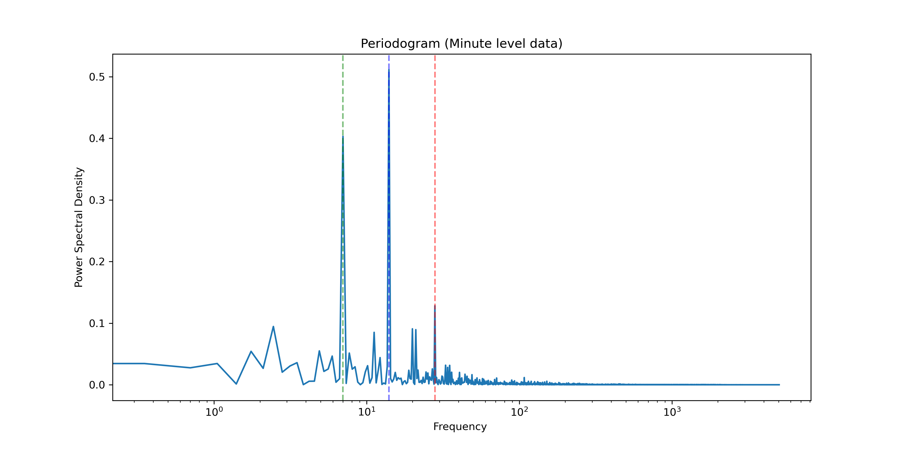
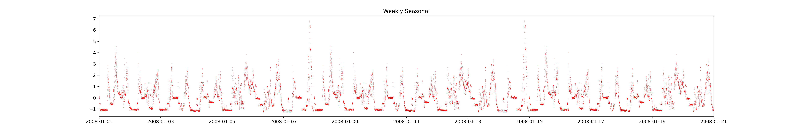
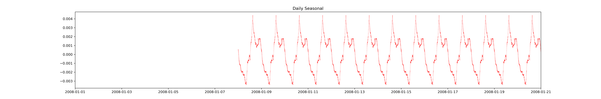
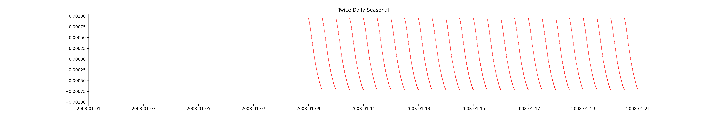
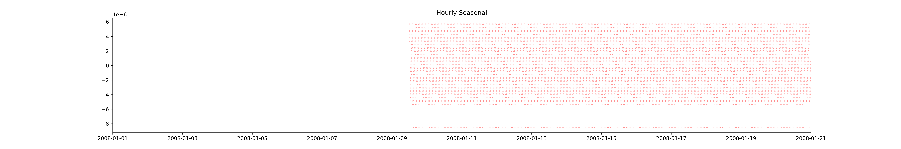
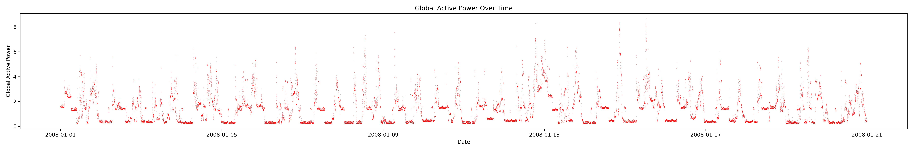
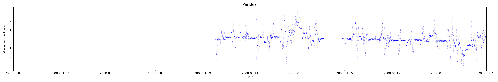

## Set-up

So I'm using the `household_power_consumption.txt` dataset from the UCI Machine Learning Repository. This is a dataset of household electricity consumption in the United States. The dataset contains 13,332 observations, with each observation representing the consumption of electricity in a household in the United States.

The dataset is stored in a text file, with each line representing a household and the columns representing the date, time, and the electricity consumption in kilowatt-hours (kWh). The data is in the format `Date, Time, Global_active_power`.

## Power Spectral Density

Having inspected this we're not expecting to see much of a seasonal pattern at the weekly level.
Most of the emphasis is daily, 12 hourly, or 6 hourly

## Seasonal decomposition

### Weekly

### Daily

### Twice Daily

### Hourly

## Raw vs Residual

